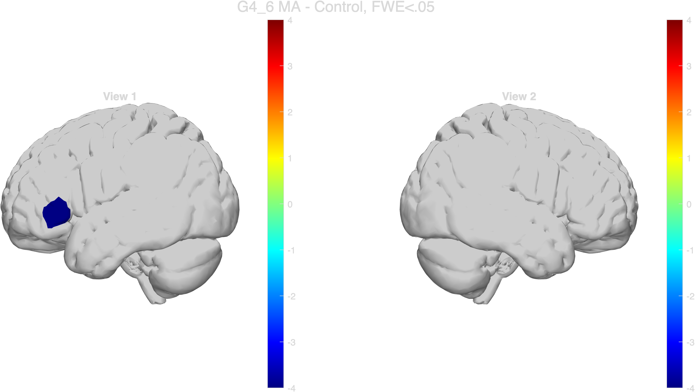
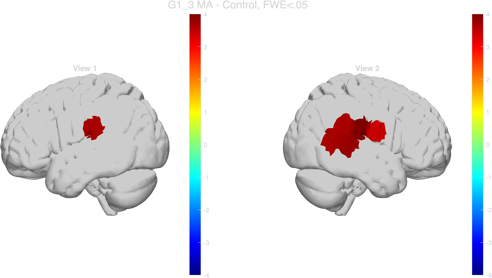
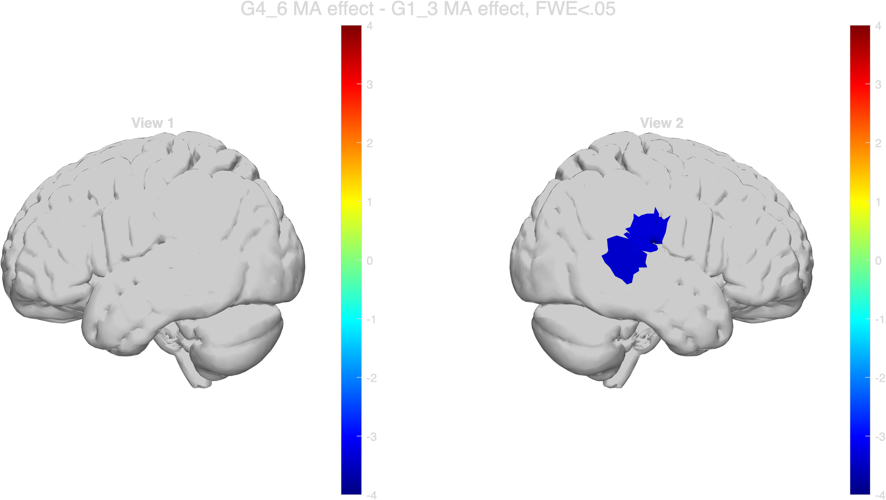
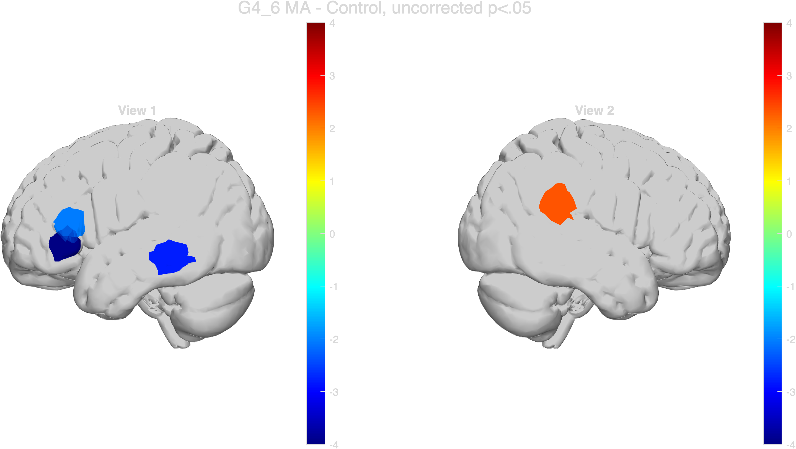
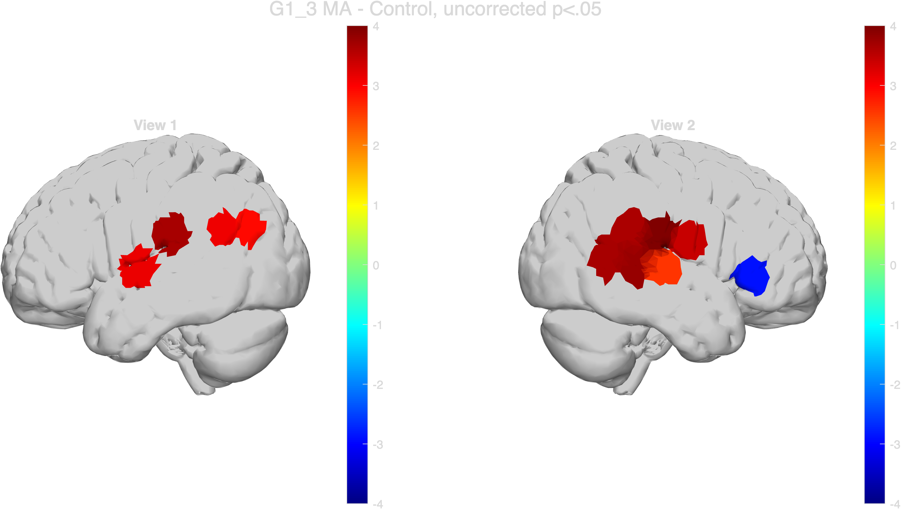
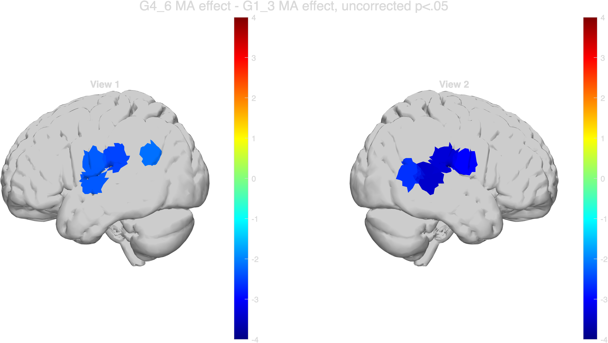

# Preliminary fNIRS Analysis Pipeline for Children's Language-Related Tasks

## Project Summary

This project aims to organize and document a preliminary fNIRS analysis pipeline for children's language-related tasks. The current analysis script includes data loading, stimulus condition checking, preprocessing, hemoglobin signal conversion, first-level GLM, group-level mixed-effects modeling, contrast analysis, and channel-level visualization.

The main goal of this project is not to provide a complete scientific conclusion, but to build a clear and reproducible workflow for fNIRS data analysis.

## Background

Functional near-infrared spectroscopy (fNIRS) is a non-invasive neuroimaging method that can be used to measure changes in oxygenated and deoxygenated hemoglobin during cognitive tasks. In this project, fNIRS data are analyzed to explore children's brain responses during language-related processing.

## Data

The data come from a lab-based fNIRS study involving child participants. Because the data involve human participants and may contain sensitive information, the raw data are not publicly shared in this repository.

More details about data privacy are provided in:

data_description/data_privacy.md

## Analysis Pipeline

The current MATLAB script includes the following steps:

1. Load fNIRS data
2. Rename task conditions
3. Check stimulus completeness
4. Label short-separation channels
5. Resample the data
6. Convert raw intensity to optical density
7. Convert optical density to HbO and HbR signals
8. Trim baseline periods
9. Run first-level GLM
10. Run group-level mixed-effects model
11. Conduct contrast analyses
12. Visualize channel-level results

## Tools

- MATLAB
- NIRS Brain AnalyzIR Toolbox
- Git and GitHub

## Repository Structure

fnirs-ma-brainhack-final-project/
- README.md
- .gitignore
- scripts/
- notebooks/
- report/
- slides/
- figures/
- data_description/

## File Description

- scripts/: MATLAB scripts for fNIRS preprocessing and statistical analysis
- notebooks/: notebooks for documentation or future analysis
- report/: project report
- slides/: final presentation slides
- figures/: non-sensitive output figures
- data_description/: data source and privacy documentation

## New Skills Learned

Through this project, I aim to practice and document the following skills:

- Organizing a reproducible brain data analysis project
- Documenting an fNIRS analysis workflow
- Understanding preprocessing steps in fNIRS analysis
- Applying GLM-based analysis to fNIRS data
- Using GitHub for open-science-oriented project submission

## Current Status

The original MATLAB analysis script has been added to the scripts/ folder. The next step is to split the script into clearer sections and document the input and output of each analysis step.

## Limitations

The raw data are not included due to privacy and ethical restrictions. Some paths in the original script may refer to local folders and will need to be revised or documented before the workflow can be fully reproduced by others.

## Next Steps

1. Review the original MATLAB script
2. Split the script into smaller analysis steps
3. Add comments explaining each step
4. Generate example output figures
5. Write a project report
6. Prepare final presentation slides

## Results

The final analysis focused on three MA-related contrasts:

1. G4_6 MA - Control
2. G1_3 MA - Control
3. G4_6 MA effect - G1_3 MA effect

Both FWE-corrected and uncorrected results were generated. The FWE-corrected results were treated as the main findings, while the uncorrected results were used as exploratory evidence to show broader activation patterns.

### FWE-corrected results

Using a Bonferroni/FWE-corrected threshold, significant MA-related effects were observed in the following channels:

| Contrast                        | Direction | Significant channels     |
| ------------------------------- | --------- | ------------------------ |
| G4_6 MA - Control               | Negative  | Ch 1                     |
| G1_3 MA - Control               | Positive  | Ch 8, 23, 25, 26, 27, 28 |
| G4_6 MA effect - G1_3 MA effect | Negative  | Ch 25, 26                |

The corrected results suggest that the G1_3 group showed stronger MA-related activation than the G4_6 group in channels 25 and 26. Because the current results are based on channel-level analysis, brain-region interpretation should be made cautiously unless reliable channel-to-region correspondence is further confirmed.

### Uncorrected results

At the uncorrected threshold of p < .05, additional channels showed significant effects:

| Contrast                        | Positive channels                       | Negative channels              |
| ------------------------------- | --------------------------------------- | ------------------------------ |
| G4_6 MA - Control               | Ch 27                                   | Ch 1, 2, 15                    |
| G1_3 MA - Control               | Ch 5, 8, 12, 14, 23, 24, 25, 26, 27, 28 | Ch 18                          |
| G4_6 MA effect - G1_3 MA effect | None                                    | Ch 5, 6, 8, 12, 23, 25, 26, 28 |

The uncorrected results were interpreted as exploratory and were not treated as the primary evidence.

### Output files

The final brain maps and significant-channel tables are available in the following folders:

* `results/brain_maps/corrected`
* `results/brain_maps/uncorrected`
* `results/tables/corrected`
* `results/tables/uncorrected`

### Corrected brain maps

#### G4_6 MA - Control

#### G1_3 MA - Control

#### G4_6 MA effect - G1_3 MA effect

### Uncorrected brain maps

#### G4_6 MA - Control

#### G1_3 MA - Control

#### G4_6 MA effect - G1_3 MA effect

